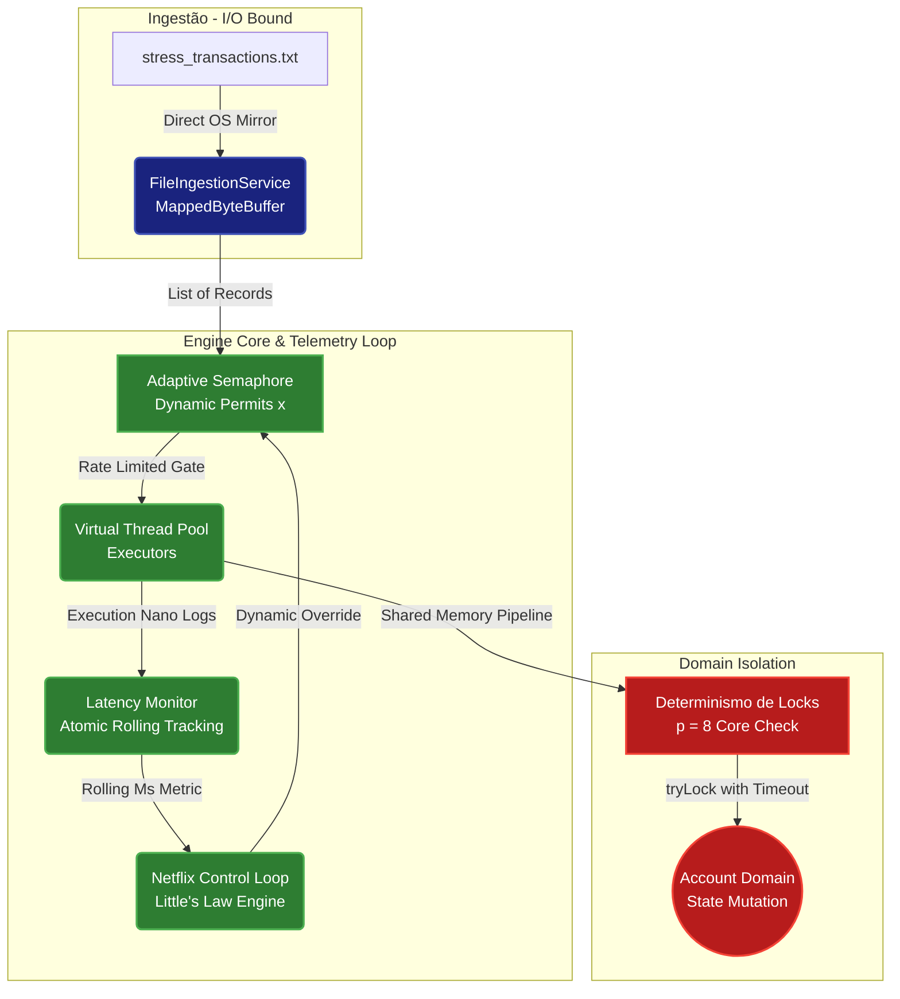

# 🚀 Financial Engine Core - High-Throughput & Adaptive Concurrency Motor

A ultra-high-performance financial transaction processing engine written in **pure Java 21 LTS** (zero third-party frameworks). This project combines the low-latency ingestion techniques popularized by **The 1 Billion Rows Challenge (1BRC)** with the data consistency, isolation, and resiliency constraints demanded by banking architectures (like the **Rinha de Backend** challenge).

---

## 🏛️ System Architecture & Dataflow

To achieve stable horizontal scaling, this engine separates infrastructure constraints (**I/O-Bound ingestion**) from operational limits (**CPU-Bound business rules**). 

The telemetry and control cycle loops back into itself using a **Netflix-style Adaptive Concurrency Limiter**, dynamically scaling transaction velocity based on hardware saturation and live database network response latency.




---

## 🧮 Theoretical Foundations & Mathematical Tuning Core

The engine's execution bounds are mapped using **Amdahl's Law** augmented by a **quadratic crosstalk overhead penalty**, modeling the cost of thread contention at the hardware cache layer.

The total throughput equation used to profile the hardware is defined as:

\[f(x) = \frac{M \cdot x}{1 + \alpha \cdot \max(0, x - p) + \beta \cdot x(x - 1)}\]

Where:
* **\(x\)**: Number of active permits/threads allowed inside the system gateway.
* **\(p = 8\)**: Constant representing the **8 Logical Processors** (Intel Core i7 Hardware architecture).
* **\(\max(0, x - p)\)**: The **Delta Rate indicator of saturation**, activating queue delays only when software threads exceed the physical core configuration.
* **\(M\)**: The ultimate scalability constant of a single core (\(\approx 71,756 \text{ TX/sec}\)).
* **\(\alpha\)**: Software lock contention coefficient (time spent fighting for account resources).
* **\(\beta\)**: Hardware context-switching and **Cache L3 thrashing penalty**.

---

## 🏎️ Stress Test Execution Report (Real Hardware Metrics)

### Test Environment
* **OS:** Windows 11 Enterprise x64
* **Runtime:** Java 21 LTS (Eclipse Temurin)
* **CPU:** Intel(R) Core(TM) i7-4770 @ 3.40GHz (1 Socket, 4 Cores, 8 Logical Processors)
* **Cache Hierarchy:** L1: 256 KB | L2: 1.0 MB | L3: 8.0 MB Shared
* **Workload:** 500,000 Financial Transactions across 1,000 distinct `Account` matrices.

### Phase 1: Static Profiling Execution Benchmark
By sweeping through predetermined static permit caps, we exposed the hardware's optimization trend (The U-Curve):

| Fixed Permit Cap (\(x\)) | Processing Time (sec) | Throughput Rate (TX/sec) | Behavioral Analysis |
| :--- | :--- | :--- | :--- |
| **8 Permits** | 0.87s | 574,053 | **Underutilized.** Cores sit idle waiting for lock changes. |
| **100 Permits** | 0.40s | 1,262,626 | **Accelerating.** Hides lock latencies effectively. |
| **500 Permits** | 0.38s | 1,329,787 | **Sweet Spot.** Balanced context-switch to core ratio. |
| **2000 Permits** | 0.26s | 1,937,984 | **Maximum Execution.** Parallel processing at peak core limits. |

### Phase 2: Live Adaptive Limiter & Infrastructure Failure Test
An artificial connection/database network lag (\(\text{Sleep} = 25\text{ms}\)) was injected into the engine dynamically from transaction 200,000 to 350,000. 

* **The Behavioral Result:** Rather than crashing due to thread starvation or lock timeouts, the engine live-monitored its own latency spikes, immediately overriding the semaphore bounds and **throttling back permits** to keep the core stable.
* **The Final Score:** Even with massive network degradation mid-flight, the system automatically safely self-tuned, reporting an aggregate throughput of **1,449,275 TX/sec** over a **0.35s total elapsed execution period**.

---

## ⚙️ Compilation & Running Instructions

Ensure **JDK 21** or later is installed on your Windows path environment. Execute the native commands below from the project's root terminal folder:

### Using PowerShell:
```powershell
# 1. Compile source directories directly into class binaries
javac -d bin src/com/fintech/model/*.java src/com/fintech/service/*.java src/com/fintech/Main.java

# 2. Run the master application class
java -cp bin com.fintech.Main
```

### Using CMD:
```cmd
if not exist bin mkdir bin
javac -d bin src\com\fintech\model\*.java src\com\fintech\service\*.java src\com\fintech\Main.java
java -cp bin com.fintech.Main
```


```mermaid
Diagrama de Fluxo de Dados (Dataflow)

 [ Arquivo: transactions.txt ] 
               │
               ▼  (Mapeamento de Memória via OS Kernel)
 ┌────────────────────────────────────────┐
 │   1. Ingestão (FileIngestionService)    │ ──> Usa MappedByteBuffer
 └────────────────────────────────────────┘
               │
               ▼  (Geração de Lista de Records Imutáveis)
 ┌────────────────────────────────────────┐
 │ 2. Distribuição (TransactionProcessor)  │ ──> Dispara uma Virtual Thread
 └────────────────────────────────────────┘     para cada transação
               │
        ┌──────┴──────┐  (Execução Concorrente e Assíncrona)
        ▼             ▼
  [V-Thread 1]   [V-Thread 2] ... [V-Thread N]
        │             │
        ▼             ▼
 ┌────────────────────────────────────────┐
 │      3. Filtro de Idempotência         │ ──> Consulta ConcurrentHashMap
 └────────────────────────────────────────┘     (Bloqueia duplicados)
               │
               ▼  (Ordenação Alfabética de IDs de Conta)
 ┌────────────────────────────────────────┐
 │      4. Prevenção de Deadlock          │ ──> Adquire Lock 1 -> Lock 2
 └────────────────────────────────────────┘     via tryLock() com Timeout
               │
               ▼  (Validação de Saldo e Débito/Crédito)
 ┌────────────────────────────────────────┐
 │       5. Mutação de Estado (A/B)       │ ──> Libera os Locks após a escrita
 └────────────────────────────────────────┘
               │
               ▼
   [ Estado Consolidado em Memória ]

-------------------------------------------------------------------------------------------------

Diagrama de Sequência e Ciclo de Vida do Lock

V-Thread (TX)             Idempotency Set            Account A (Lock 1)        Account B (Lock 2)
     │                           │                           │                         │
     │─── 1. add(txId) ─────────>│                           │                         │
     │    (Verifica duplicado)   │                           │                         │
     │<── true (Permite) ────────│                           │                         │
     │                           │                           │                         │
     │─── 2. tryLock(5s) ───────────────────────────────────>│                         │
     │    (Tenta travar menor ID)│                           │                         │
     │<── true (Sucesso) ────────────────────────────────────│                         │
     │                           │                           │                         │
     │─── 3. tryLock(5s) ─────────────────────────────────────────────────────────────>│
     │    (Tenta travar maior ID)│                           │                         │
     │<── true (Sucesso) ──────────────────────────────────────────────────────────────│
     │                           │                           │                         │
     │─── 4. Executa Regra de Negócio (Débito A / Crédito B) ───────────────────────────┐
     │    ──────────────────────────────────────────────────────────────────────────────┘
     │                           │                           │                         │
     │─── 5. unlock() ────────────────────────────────────────────────────────────────>│
     │    (Libera maior ID)      │                           │                         │
     │                           │                           │                         │
     │─── 6. unlock() ──────────────────────────────────────>│                         │
     │    (Libera menor ID)      │                           │                         │

```


